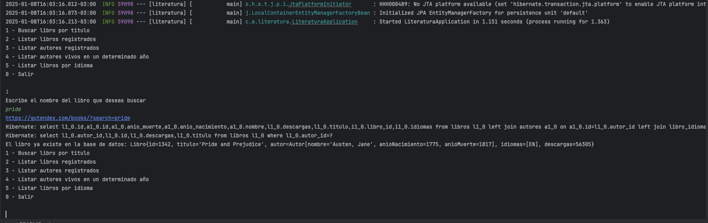
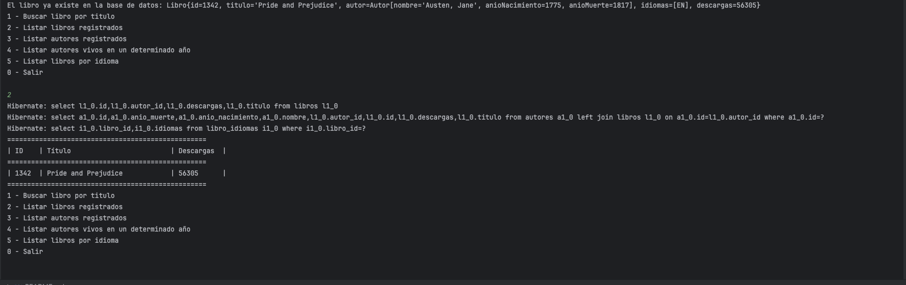
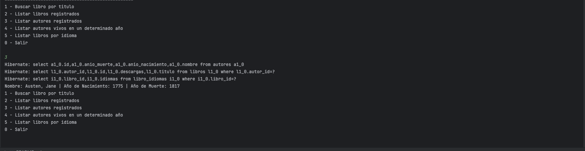
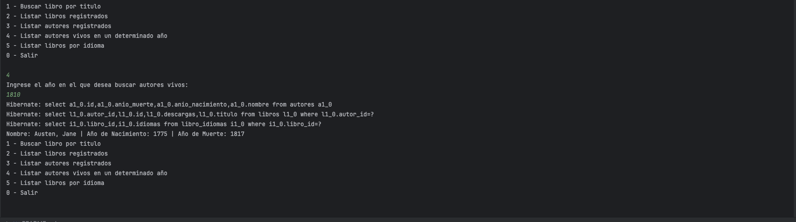
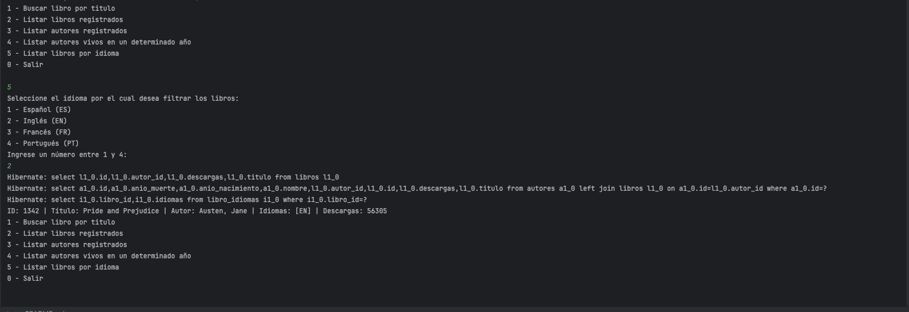

# Literatura

## Objetivo del Proyecto

El objetivo es crear un backend en Spring Boot que esté disponible a través de una interfaz de línea de comandos (shell). Este backend permitirá acceder a una API para obtener datos de libros y autores, y almacenarlos en la base de datos del proyecto.

## Datos de la API

La API de Gutendex permite obtener datos de libros y autores. La documentación de la API se encuentra en https://gutendex.com/.

## Instalación

1. Clona el repositorio:
    ```bash
    git clone https://github.com/carlosferreyra/alura-literatura.git
    ```
2. Navega al directorio del proyecto:
    ```bash
    cd literatura
    ```
3. Compila el proyecto con Maven:
    ```bash
    mvn clean install
    ```

## Tecnologías Utilizadas

- Java 17
- Maven (gestor de dependencias)
- JPA (Java Persistence API)
- PostgreSQL (base de datos)
- Jackson (manipulación y mapping de JSON)

## Ambiente de Desarrollo

- IDE: IntelliJ IDEA
- Control de versiones: Integrado con IntelliJ VCS
- Base de datos:
  - Nombre: alura_literatura
  - Usuario: carlosferreyra

## Capturas de Pantalla

### Buscar en la API de Gutendex



### Listar Libros



### Listar Autores



### Listar Autores vivos segun año



### Listar Libros segun Idioma



## Licencia

Este proyecto está licenciado bajo la Licencia MIT. Consulta el archivo `LICENSE` para más detalles.

## Challenge

Este proyecto es un challenge de Alura para la beca Oracle Next Education - G7.

## Autor

Carlos Eduardo Ferreyra - eduferreyraok@gmail.com - [LinkedIn](https://www.linkedin.com/in/eduferreyraok/)
